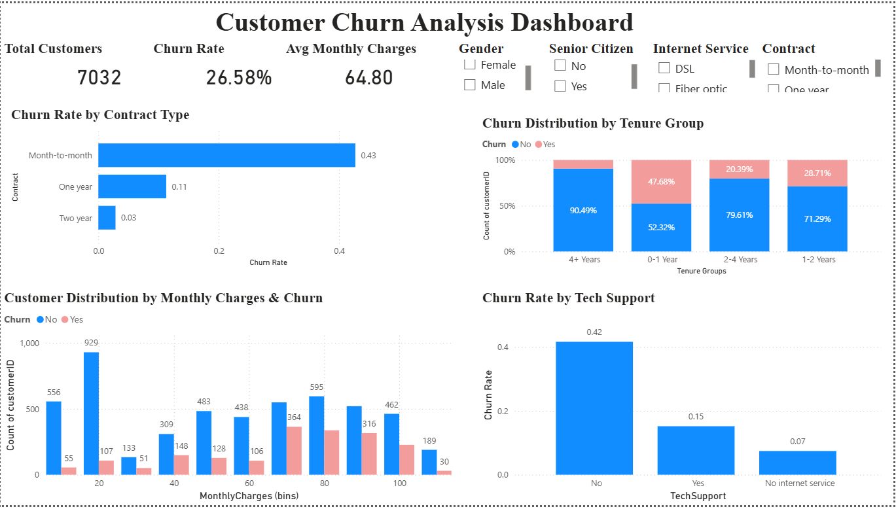

# 📊 Customer Churn Analysis Dashboard

## 📌 Project Overview

This project analyzes customer churn in a telecom subscription-based business using Power BI. The dashboard provides insights into customer behavior, retention trends, and key factors influencing churn to support data-driven decisions.

---

## 🎯 Objectives

* Analyze churn rates and retention trends
* Understand customer lifetime patterns
* Identify high-risk customer segments
* Determine key drivers of churn
* Provide actionable business recommendations

---

## 📊 Key Insights

### 🔹 Churn & Retention Trends

* Overall churn rate is **26.58%**, showing a significant number of customers leaving
* Customers with **longer tenure (4+ years)** have strong retention (~90%)
* **New customers (0–1 year)** show the highest churn (~47%), indicating onboarding issues

---

### 🔹 Customer Segments at Risk

* Customers on **month-to-month contracts** have the highest churn (~43%)
* **New customers in early stages** are more likely to leave
* Customers with **higher monthly charges** show increased churn
* Users without **tech support services** are more likely to churn

---

### 🔹 Customer Lifetime Patterns

* Most customers churn within the **first year**
* Customers staying beyond **2–3 years** tend to remain loyal
* Early customer experience plays a critical role in retention

---

### 🔹 Key Churn Drivers

* Short-term contracts (month-to-month)
* High pricing (monthly charges)
* Lack of support services
* Low engagement during early customer lifecycle

---

## 💡 Business Recommendations

* Promote **long-term contracts** with offers and discounts
* Improve **onboarding experience** for new customers
* Provide better **technical support services**
* Optimize **pricing strategies**
* Focus on retaining high-risk customers through targeted campaigns

---

## 🛠 Tools & Technologies

* Power BI
* DAX (Data Analysis Expressions)
* Data Cleaning & Transformation

---

## 📸 Dashboard Preview

---

## 🎯 Conclusion

The dashboard highlights key churn patterns and customer behavior, helping businesses identify risk factors and improve retention strategies. Focusing on early engagement, pricing, and support services can significantly reduce churn and increase customer lifetime value.
